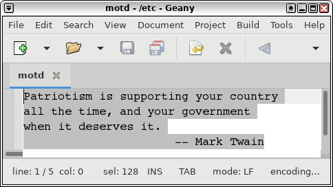
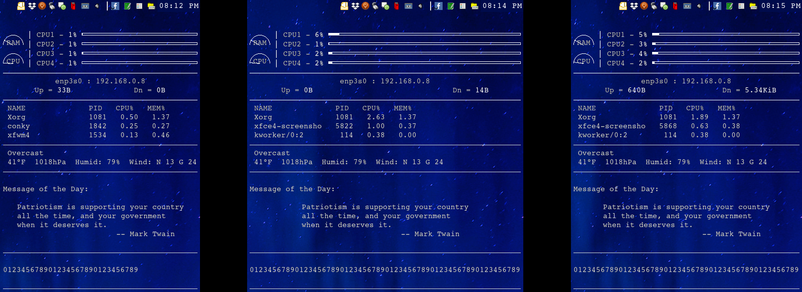

# conky-text-block-centering
Lua script for centering a block of text in Conky

Reads lines of text from a text file, and then adds a conky center
alignment object (i.e. ${alignc}) to the beginning of each line
while equalizing the length of each line.

Example:
- Text block with varied length lines in text file...

- Text block displayed in Conky at various widths...

Usage:
- Add alignc.lua to a load_lua line in your .conkyrc file.
- Add a $lua_parse line with a text file containing a block of
  text as the argument to your .conkyrc file where the text block
  is to appear (e.g. ${lua_parse conky_alignc /home/User/mytextfile}).
- Use a monospace font. If your default font isn't monospace,
  preceed the $lua_parse line with a $font line to change to
  monospace and follow it with a $font line to change it back.
- If quotation marks or apostrophes are needed in a text block,
  use straight quotes. Curly quotes (e.g. Unicode characters U+2018 and U+2019)
  can cause misalignment of the text block.
